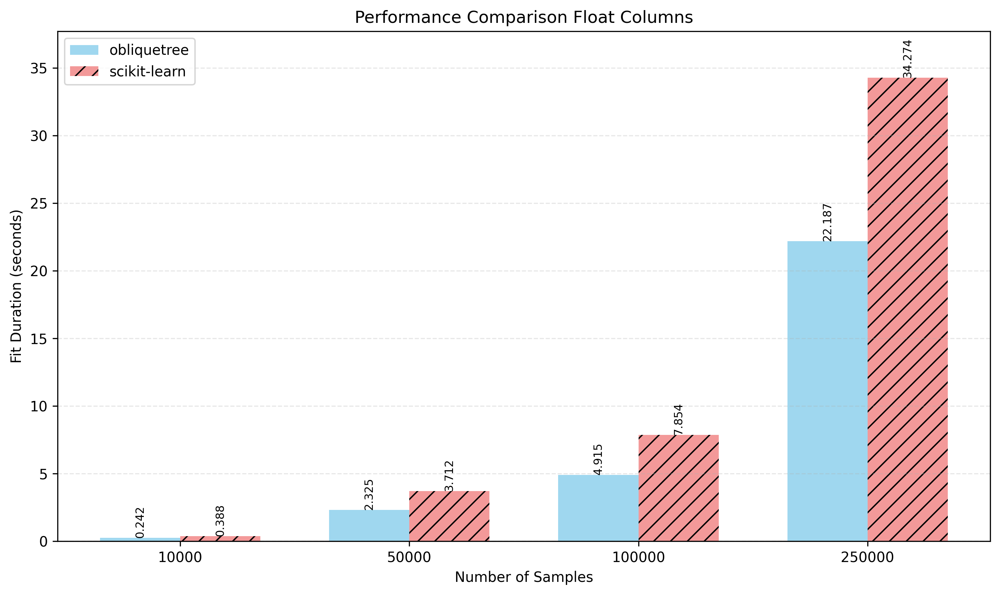
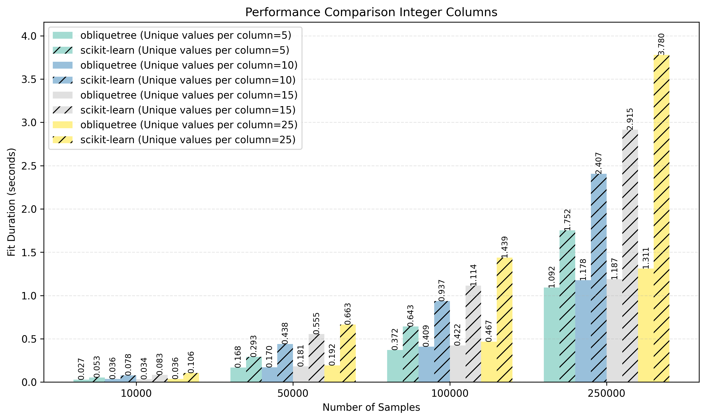

# Introduction

`obliquetree` is an advanced decision tree implementation designed to provide high-performance and interpretable models. It supports both traditional and oblique splits, ensuring flexibility and improved generalization with shallow trees. This makes it a powerful alternative to regular decision trees, especially for datasets with high-dimensional or complex relationships.


-----
## Installation 
To install `obliquetree`, use the following pip command:

```bash
pip install obliquetree
```
-----

## Documentation
For more detailed information about the API and advanced usage, please refer to the full  [documentation](https://obliquetree.readthedocs.io/en/latest/).

---
## **Key Features**

- **Oblique Splits**  
  Perform oblique splits using linear combinations of features to capture complex patterns in data. Supports both linear and soft decision tree objectives for flexible and accurate modeling.

- **Axis-Aligned Splits**  
  Offers conventional (axis-aligned) splits, enabling users to leverage standard decision tree behavior for simplicity and interpretability.

- **Feature Constraints**  
  Limit the number of features used in oblique splits with the `n_pair` parameter, promoting simpler, more interpretable tree structures while retaining predictive power.

- **Seamless Categorical Feature Handling**  
  Natively supports categorical columns with minimal preprocessing. Only label encoding is required, removing the need for extensive data transformation.

- **Exact Equivalence with scikit-learn**  
  Guarantees results identical to scikit-learn's decision trees when oblique and categorical splitting are disabled, ensuring compatibility for existing workflows.

- **Robust Handling of Missing Values**  
  Automatically assigns `NaN` values to the optimal leaf for axis-aligned splits. For oblique splits, imputation ensures smooth operation.

- **Customizable Tree Structures**  
  Flexible API allows users to extend and tailor tree structures to implement specialized variants or novel splitting criteria.

- **Optimized Performance**  
  Outperforms scikit-learn in terms of speed and efficiency without compromising accuracy:
  - Up to **40% faster** for datasets with float columns.
  - Up to **300% faster** for datasets with integer columns.

  

  


----
### Contributing
Contributions are welcome! If you'd like to improve `obliquetree` or suggest new features, feel free to fork the repository and submit a pull request.

-----
### License
`obliquetree` is released under the MIT License. See the LICENSE file for more details.