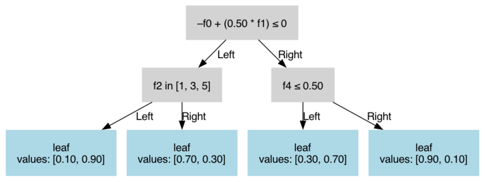

# Building Custom Tree

```{note}
This section is primarily designed for advanced users who need to quickly implement their own custom trees, typically for research purposes or other specific requirements. It is intended for those who need to manually define their tree structures.
```

```{warning}
The `load_tree` function operates in an **unsafe** manner. It does not perform input validation or buffer indexing checks. This means users must ensure their inputs are correctly formatted and free of errors to avoid critical issues.
```

The structure of a tree in an `obliquetree` is as follows:

```json
{"params": {}, "tree": {}}
```

This simple and flexible structure allows users to quickly build custom trees tailored to their needs.

---

## Explanation of `"params"`

In the output of `obliquetree.export_tree` function, `"params"` key contains several parameters, but the mandatory ones required to create a custom tree are:

```json
{
    "params": {
        "task": false,
        "n_classes": 2,
        "n_features": 5
    }
}
```

- **`task`**: Specifies the type of task.
  - `true`: Indicates a regression task.
  - `false`: Indicates a classification task.
- **`n_classes`**: Specifies the number of classes in the target variable.
  - Regression (`task: true`): `n_classes` is set to 1, as regression does not involve multiple classes.
  - Classification (`task: false`): `n_classes` corresponds to the number of classes in the target variable.
- **`n_features`**: Specifies the total number of features (columns) in the input dataset.

---

## Explanation of `"tree"`

In the `"tree"` structure, you have the flexibility to include optional properties like `n_samples` (number of samples in a node) and `impurity` (a measure of the node's impurity). However, these are not mandatory for defining the tree.

---

### 1. Axis-Aligned Split Node

For a feature index $i$ and threshold $t$:
- **Decision function**: $f(x) = x[i] <= t$
- **Traversal logic**:
  - Go to the **left child** if $f(x)$ is true.
  - Go to the **right child** if $f(x)$ is false.
- **Explanation**:
  - `is_leaf` set to `false`.
  - `is_oblique` set to `false`.
  - `feature_idx` specifies the index of the feature used for splitting.
  - `threshold` is the value compared against the feature. If the feature value is less than the threshold, traversal proceeds to the left child.
  - `missing_go_left` determines the direction when the feature value is missing. If `true`, traversal goes left. If `false`, traversal goes right.

```json
{
    "is_leaf": false,
    "is_oblique": false,
    "feature_idx": 0,
    "threshold": -1.32,
    "missing_go_left": true,
    "left": {},
    "right": {}
}
```

---

### 2. Oblique Split Node

For a weight vector $w \in \mathbb{R}^k$ and feature indices $F = \{f_1, \dots, f_k\}$:
- **Decision function**: $f(x) = \sum_i (w_i \cdot x[f_i]) < t$
- **Traversal logic**:
  - Go to the **left child** if $f(x)$ is true.
  - Go to the **right child** if $f(x)$ is false.
- **Explanation**:
  - `is_leaf` set to `false`.
  - `is_oblique` set to `true`.
  - `weights` specifies the coefficients for the linear combination of features.
  - `features` lists the indices of the features used in the linear combination.
  - `threshold` is the value compared against the linear combination. If the result is less than the threshold, traversal proceeds to the left child.

```json
{
    "is_leaf": false,
    "is_oblique": true,
    "weights": [-0.04, -1.0],
    "features": [4, 10],
    "threshold": -0.87,
    "left": {},
    "right": {}
}
```

---

### 3. Categorical Split Node

For a feature index $i$ and category set $C$:
- **Decision function**: $f(x) = x[i] \in C$
- **Traversal logic**:
  - Go to the **left child** if $f(x)$ is true.
  - Go to the **right child** if $f(x)$ is false.
- **Explanation**:
  - `is_leaf` set to `false`.
  - `is_oblique` set to `false`.
  - `category_left` specifies the set of categories that lead to the left child.
  - `feature_idx` identifies the feature used for the categorical split.
  - `missing_go_left` behaves the same as in other nodes.

```json
{
    "is_leaf": false,
    "is_oblique": false,
    "feature_idx": 7,
    "category_left": [1, 2, 3, 4],
    "missing_go_left": true,
    "left": {},
    "right": {}
}
```

---

## Leaf Node Structure

### Binary Classification

- **Explanation**: In binary classification, `value` represents the probability of the positive class ($p$).
```json
{
    "is_leaf": true,
    "value": 0.75  // [0, 1], probability of positive class
}
```

---

### Multi-class Classification ($K$ classes)

- **Explanation**: In multi-class classification, `values` is an array where each entry corresponds to the probability of a class. The probabilities sum to 1 ($\sum p_i = 1$).
```json
{
    "is_leaf": true,
    "values": [0.25, 0.5, 0.25]  // values[i] in [0,1], sum(values) = 1
}
```

---

### Regression

- **Explanation**: In regression tasks, `value` is the predicted continuous numeric value.
```json
{
    "is_leaf": true,
    "value": 42.5  // predicted value
}
```

---

## Complete Example

Here is a complete example combining all split types:

```json
{
    "params": {
        "task": false,
        "n_classes": 2,
        "n_features": 5
    },
    "tree": {
        "is_leaf": false,
        "is_oblique": true,
        "weights": [-1.0, 0.5],
        "features": [0, 1],
        "threshold": 0.0,
        "missing_go_left": true,
        "left": {
            "is_leaf": false,
            "is_oblique": false,
            "feature_idx": 2,
            "category_left": [1, 3, 5],
            "missing_go_left": true,
            "left": {
                "is_leaf": true,
                "value": 0.9
            },
            "right": {
                "is_leaf": true,
                "value": 0.3
            }
        },
        "right": {
            "is_leaf": false,
            "is_oblique": false,
            "feature_idx": 4,
            "threshold": 0.5,
            "missing_go_left": false,
            "left": {
                "is_leaf": true,
                "value": 0.7
            },
            "right": {
                "is_leaf": true,
                "value": 0.1
            }
        }
    }
}
```

```python
from obliquetree.utils import load_tree, visualize_tree

clf = load_tree("custum_tree.json")
visualize_tree(clf, show_node_value=False, show_gini=False, show_n_samples=False)
``` 

